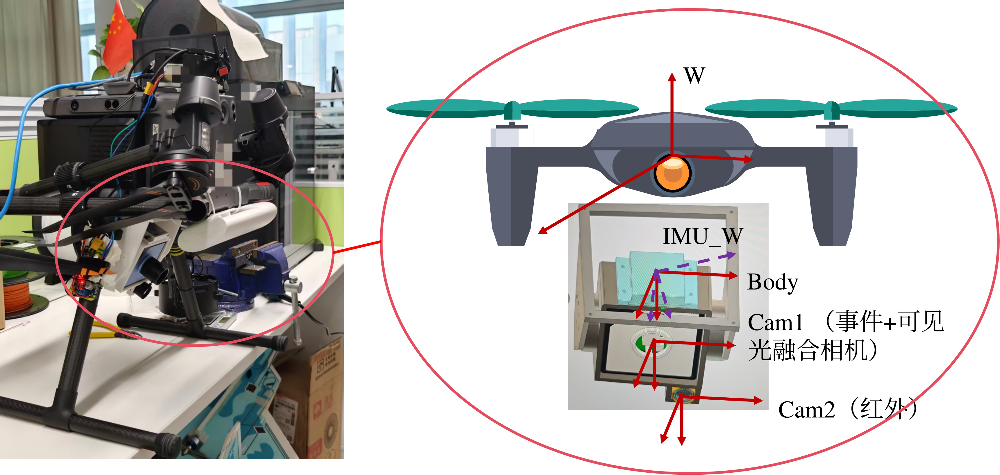

# 项目文档

## 平台概述

本平台以大疆 RTK 350 无人机为基础，集成了以下传感器。

- *动微视觉 Dvsync 融合相机（事件相机 + 可见光相机）
- *红外相机
- *H30 惯性测量单元（IMU）

```
注： 数据录制与预处理由板载平台Nvida Orin Nx实现。无人机的位置与姿态信息由RTK350获取，并通过PSDK进行订阅。相机位置和姿态通过两步标定：IMU和UAV标定，UAV和相机标定获取，其中我们仅关注相机与UAV的姿态，它们的平移为一固定值，在高空场景这一点可以被忽略。
```
```
模态对齐：
*   融合相机已经经过预标定，理论上事件与可见光模态可实现亚像素级别对齐；
*   红外与可见光相机的内外参均已知，可通过像素投影简单对齐（无法做到像素级别）；
时间戳对齐：
 *  事件与可见光的时间戳对齐在相机内部完成，理论上可以忽略；
 *  UAV与IMU时间戳通过信息订阅实现，因为数据量较少，两者延迟可通过角速度相关性计算获得，小于0.005s；
 *  融合相机与IMU时间戳通过软触发对齐，由于图像数据较大，该部分延迟标准差可达到4ms; 
```

平台整体架构如下图所示：

  
*图：无人机飞行平台实物*

---

## 功能简介

| 组件 | 说明 | 路径 |
|------|------|------|
| 融合相机驱动 | 提供实时预览与数据采集 | `event_cam_driver/DvsenseSyncViewerSample` |
| 融合数据文件读取器 | 读取保存的相机数据文件 | `event_cam_driver/DvsenseFileReaderSample` <br> `event_cam_driver/DvsenseFusionFileReaderSample` |
| 惯性传感器驱动 | 获取H30 IMU 数据 | `inertial_driver` |
| 红外传感器驱动 | 获取红外相机数据 | `infrared_cam_driver` |
| 工具箱 | 包含相机标定、IMU+相机联合标定、IMU+无人机联合标定等工具 | `tools` |
| 启动脚本与可执行文件 | 存放所有模块的启动脚本和编译生成的可执行文件 | `launch` |

---

## 安装编译

### 1. 融合相机软件

- **底层驱动安装**
  **x86 平台**：参考官方文档 [安装指南](https://sdk.dvsense.com/zh/html/install_zh.html)
  **Arm 平台**：
    ```bash
    sudo dpkg -i ./3rdpart/libDvsenseDriver-dev_1.1.4_Linux_aarch64.deb
    ```
- **编译融合相机软件**
    ```bash
   cd event_cam_driver/
   mkdir -p build && cd build
   cmake ..
   make -j4
    ```
	
###  2. 编译惯性传感器驱动
  ```bash
  cd ../inertial_driver/
  make
  mv yesense_main ../launch/
  ```

### 3. 编译红外传感器驱动
 ```bash
 cd ../infrared_cam_driver/
 mkdir -p build && cd build
 cmake ..
 make -j4
  ```
## 远程调试支持
如果使用VNC进行远程调试（用于远程桌面）：
```bash
sh ~/start_vnc.sh
```

图传功能：远程上位机通过以下命令接收相机推送的图片，如果接收不到请检查上位机与接收端是否在同一网段，ip设置是否正确：
```bash
python ./launch/receiver.py
```

## 数据录制

| 模块 | 命令 |
|------|------|
| 录制事件相机数据 | `./launch/dvsense_recorder [选项]`<br>可选参数：`is_record_image` `is_record_event` `is_display` `dest_ip` `dest_port`（`dest_ip` `dest_port`用于图传ip指定） |
| 录制惯导数据 | `./launch/yesense_main your_file_name.txt`（请替换为实际文件名） |
| 录制红外相机数据 | `./launch/infrared_driver` |
| 订阅无人机姿态信息 | `./launch/dji_sdk_demo_linux_cxx` |
| 一键启动所有模块 | `chmod +x ./launch/launch_all.sh` && `./launch/launch_all.sh` |
| 仅启动融合相机和 IMU | `./launch/launch_event_cam.sh` |
| 仅启动红外相机和 IMU | `./launch/launch_infrared_cam.sh` |
| 一键关闭所有模块 | `./launch/kill_all.sh` |


## 数据处理与工具箱

### 数据回放

- **回放事件数据（.raw 文件）**
  ```bash
  ./tools/dvsense_file_reader your_file_name.raw
   ./tools/dvsense_fusion_reader
   ```

- **将事件、图像、IMU数据转化为Rosbag （数据路径为默认）**
    转换为 ROS bag 文件：
   ```bash
    ./tools/dvtorosbag
	```

### 标定工具
#### 相机标定
- **安装相机标定依赖**
   ```
   sudo apt install python3-opencv
   ```
- **标定指令**
   ``` bash
    sh ./tools/cam_imu_calib/calib_cameras.sh 
   ```
   或者：
    ```
    python ./tools/cam_imu_calib/calib_cameras_opencv.py
   ```
   
#### IMU+相机联合标定
- **标定工具箱安装**
   参考 Kalibr 项目（https://github.com/ethz-asl/kalibr）
- **标定指令**
    ``` bash
   sh ./tools/cam_imu_calib/calib_cam_imu.sh
    ``` 
	
#### IMU+UAV联合标定
    该步骤为了求解无人机与惯导的旋转矩阵：
    ``` bash
        python ./tools/uav_imu_calib/calib_imu_to_uav.py
    ``` 

### 已保存数据目录

默认数据存储位置：
```
事件数据：./save_data/event_data
图像数据：./save_data/image_data
红外数据：./save_data/infrared_data
惯性数据：./save_data/inertial_data
无人机数据：./save_data/drone_data
```

## 目录结构说明
```
.
├── 3rdpart/                    # 第三方依赖包
├── event_cam_driver/            # 事件相机驱动及相关示例
├── inertial_driver/             # 惯性传感器驱动
├── infrared_cam_driver/         # 红外相机驱动
├── launch/                      # 启动脚本与可执行文件
├── tools/                       # 工具箱（标定、转换等）
│   ├── cam_imu_calib/           # 相机-IMU 标定工具
│   └── uav_imu_calib/           # 无人机-IMU 标定工具
└── save_data/                   # 默认数据存储目录（自动生成）
```


